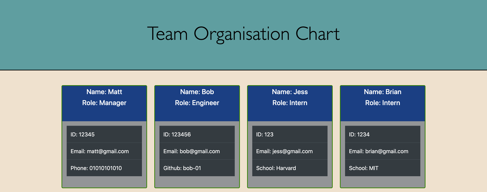

# Team-Profile Generator

# Table of Contents
- [Description](#description)
- [Installation](#installation)
- [Instructions](#instructions)
- [Credits](#credits)
- [Contributions](#contributions)
- [Tests](#tests)
- [Questions](#questions)
- [License](#license)
---
## Screenshot of example output:


## Description:
```
The purpose of this program is to dynamically create a team profile webpage, 
using a question/answer command-line to add the responses into HTML. 
The program uses node.js and the inquirer npm to automate an otherwise 
time consuming task.
```
---
## Installation:
```
node.js, inquirer, fs, jest
```
---
## Instructions:
```
To run the program, right-click on index.js in the root directory and 
choose 'open in integrated terminal'. Then type into the command-line 'node index.js'. 
The program will run and begin asking questions, type your answer and hit enter. 
First you will be asked to add a manager, after that you can add an engineer or intern. 
Click exit application to quit.
```
---
## Credits:
```
This work is my own.
```
---
## Contributions:
```
Please feel free to fork the repo.
```
---
## Tests:
```
Jest - used to test the Employee class constructor.
```
---
## Questions:
```  
If you have any questions please find my Github username 
and my email address below:  

* MJ-0001
* mejones92@gmail.com
```
---
## License:  

MIT  

  

https://opensource.org/licenses/MIT

---